# 🍀 Coding Clover: AI 기반 유튜브 학습 전이 및 인텔리전트 LMS 솔루션

> **"유튜브의 방대한 지식을 당신만의 완벽한 학습 데이터셋으로 전환합니다."**  
> Coding Clover는 유튜브 영상에서 AI 기술을 투입해 음성을 추출(STT)하고, 이를 기반으로 객관식 퀴즈를 자동 생성하여 학습 효율을 극대화하는 혁신적인 AI-Integrated LMS(Learning Management System)입니다.

---

## 💡 프로젝트 동기: 학습과 AI 기술의 결합 (Learning & Intelligence)

본 프로젝트는 **방대한 영상 지식의 비효율적 습득 문제**를 해결하기 위해 기획되었습니다.  

*   **한계 돌파**: 사람이 직접 강의 자막을 보고 문제를 만드는 수동성을 탈피, AI 파이프라인으로 자동화하여 즉각적으로 학습 효율을 높입니다.
*   **통합적 가치**: 단순한 퀴즈 툴이 아닌, 강좌 관리, 학생 프로필, 결제 시스템, Q&A 커뮤니티가 결합된 완전한 학습 생태계를 지향합니다.
*   **안정적인 인프라**: 대규모 데이터 처리(STT)와 보안이 강조된 설계를 통해 실제 서비스 가능한 수준의 견고한 시스템을 구축했습니다.

---

## 1) 주요 기능 (Key Features)

1.  **AI 유튜브 퀴즈 엔진 (YouTube-to-Quiz AI)**
    *   **yt-dlp 통합**: 유튜브의 음성 데이터를 고속으로 추출하여 서버 내 임시 전처리 수행.
    *   **OpenAI Whisper STT**: 단순 자막 파싱이 아닌, 실제 음성 데이터를 딥러닝으로 분석해 완벽해진 한국어 스크립트(Transcript) 생성.
    *   **GPT-4o 기반 동적 출제**: 생성된 텍스트에서 핵심 키워드를 추출하여 5지선다 객관식 문제를 1~10개까지 실시간 자동 생성.

2.  **커스텀 LMS 워크플로우 (Comprehensive LMS)**
    *   **교육 과정 관리**: 강좌(Course) 및 강의(Lecture) 등록, 학생 수강 신청(Enrollment) 및 진행률 모니터링.
    *   **통합 Q&A 및 커뮤니티**: 마크다운 기반의 정밀한 질의응답 및 학습자 간 네트외킹 공간 제공.

3.  **지능형 회원 및 보안 시스템 (Security & Profile)**
    *   **역할 기반 접근 제어 (RBAC)**: 학생과 강사 프로필을 분리하여 각각 최적화된 대시보드 제공.
    *   **Spring Security & OAuth2**: 안전한 인증 로직과 멀티 로그인 환경 지원.

---

## 2) 시스템 아키텍처 (System Architecture)

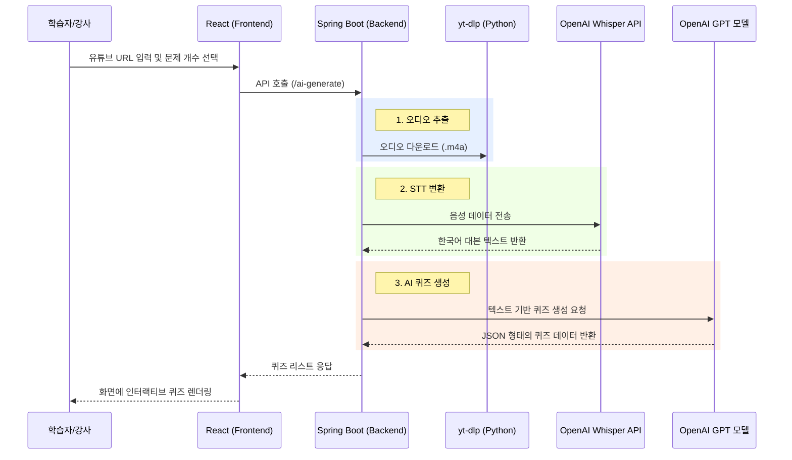

### 2-1) 백엔드 상세 흐름도 (Backend Detailed Workflow)
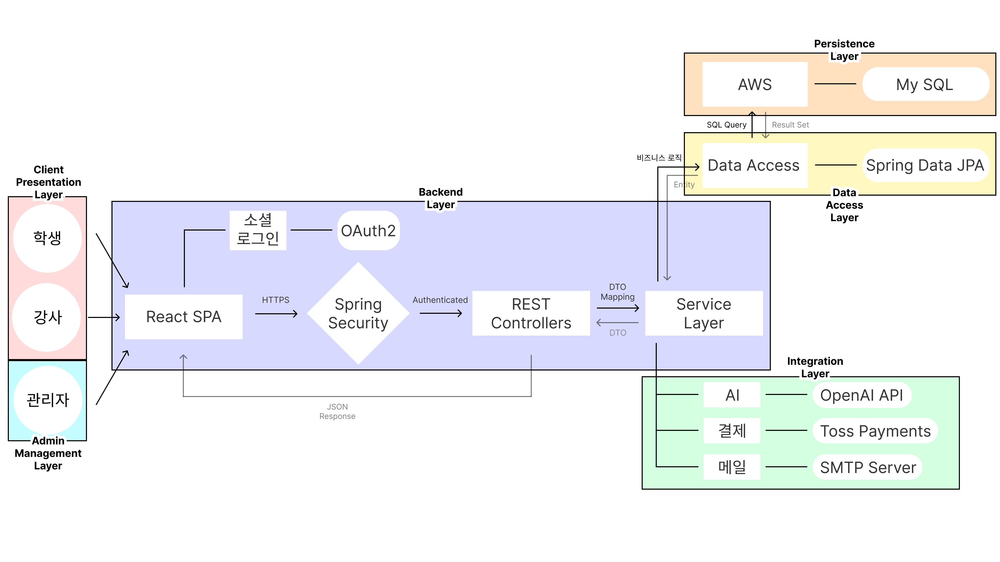

---

## 3) 기술 스택 (Tech Stack)

| Category | Technology |
| :--- | :--- |
| **Backend** | Java 21, Spring Boot 3.4.13, Gradle, Spring AI (OpenAI) |
| **Frontend** | React, JavaScript, Vanilla CSS, Axios, Lottie-React |
| **Storage** | MySQL (RDS), Amazon S3, Hibernate/JPA |
| **Security** | Spring Security 6, OAuth2, JWT |
| **External** | OpenAI Whisper (STT), OpenAI GPT-4o, yt-dlp (Python) |

---

## 4) 데이터베이스 설계 (Database Specifications)

<details>
<summary><b>📋 users (회원)</b></summary>

| Field | Type | Null | Key | Extra | Comment |
| :--- | :--- | :--- | :--- | :--- | :--- |
| user_id | bigint | NO | PRI | auto_increment | 사용자 고유 ID |
| login_id | varchar(50) | NO | UNI | | 로그인용 ID (Unique) |
| password | varchar(255) | NO | | | 암호화된 비밀번호 |
| name | varchar(50) | NO | | | 사용자 실제 이름 |
| email | varchar(100) | NO | UNI | | 이메일 주소 (Unique) |
| role | enum | NO | | | 권한 (STUDENT, INSTRUCTOR, ADMIN) |
| status | enum | NO | | | 계정 상태 (ACTIVE, SUSPENDED) |
| created_at | datetime | NO | | DEFAULT_GEN | 가입 일시 |
| updated_at | datetime | YES | | | 정보 수정 일시 |

</details>

<details>
<summary><b>📋 student_profile (학생 프로필)</b></summary>

| Field | Type | Null | Key | Extra | Comment |
| :--- | :--- | :--- | :--- | :--- | :--- |
| user_id | bigint | NO | PRI | | 사용자 고유 ID (Users FK) |
| education_level | varchar(50) | YES | | | 학생의 학습 수준/학력 |
| interest_category | varchar(100) | YES | | | 주요 관심 학습 분야 |

</details>

<details>
<summary><b>📋 instructor_profile (강사 프로필)</b></summary>

| Field | Type | Null | Key | Extra | Comment |
| :--- | :--- | :--- | :--- | :--- | :--- |
| user_id | bigint | NO | PRI | | 사용자 고유 ID (Users FK) |
| bio | text | YES | | | 강사 자기소개 및 약력 |
| career_years | int | YES | | | 교육 또는 실무 경력 연차 |
| status | enum | NO | | | 승인 상태 (APPLIED, APPROVED, REJECTED) |
| applied_at | datetime | NO | | DEFAULT_GEN | 강사 신청 일시 |
| approved_at | datetime | YES | | | 관리자 승인 일시 |
| resume_file_path | varchar(255) | YES | | | 이력서 파일 저장 경로 |
| resume_content_type | varchar(255) | YES | | | 파일 MIME 타입 |
| resume_file_data | longblob | YES | | | 파일 바이너리 데이터 |
| reject_reason | text | YES | | | 관리자 승인 반려 사유 |

</details>

<details>
<summary><b>📋 course (강좌)</b></summary>

| Field | Type | Null | Key | Extra | Comment |
| :--- | :--- | :--- | :--- | :--- | :--- |
| course_id | bigint | NO | PRI | auto_increment | 강좌 고유 ID |
| title | varchar(255) | NO | | | 강좌 제목 |
| description | text | YES | | | 강좌 상세 설명 |
| level | int | NO | | | 난이도 (1:초급, 2:중급, 3:고급) |
| price | int | NO | | | 강좌 수강료 (포인트) |
| thumbnail_url | varchar(255) | YES | | | 강좌 썸네일 경로 |
| proposal_status | varchar(20) | NO | | | 기획 승인 상태 (PENDING, APPROVED...) |
| proposal_reject_reason | varchar(255) | YES | | | 강좌 기획 반려 사유 |
| approved_by | bigint | YES | MUL | | 승인 처리 관리자 ID |
| approved_at | datetime | YES | | | 승인 완료 일시 |
| created_by | bigint | NO | MUL | | 강좌 개설 강사 ID |
| created_at | datetime | NO | | DEFAULT_GEN | 강좌 등록 일시 |
| updated_at | datetime | YES | | DEFAULT_GEN | 강좌 정보 수정 일시 |

</details>

<details>
<summary><b>📋 lecture (강의)</b></summary>

| Field | Type | Null | Key | Extra | Comment |
| :--- | :--- | :--- | :--- | :--- | :--- |
| lecture_id | bigint | NO | PRI | auto_increment | 강의 고유 ID |
| course_id | bigint | NO | MUL | | 소속 강좌 ID |
| title | varchar(255) | NO | | | 강의 소제목 |
| order_no | int | YES | | | 강의 재생 순서 번호 |
| video_url | varchar(255) | NO | | | 유튜브/영상 재생 URL |
| duration | int | NO | | | 강의 재생 시간 (초 단위) |
| created_by | bigint | NO | MUL | | 강의 등록 강사 ID |
| approval_status | enum | NO | | | 비디오 승인 상태 (PENDING, APPROVED...) |
| upload_type | enum | NO | | | 업로드 방식 (IMMEDIATE, RESERVED) |
| scheduled_at | datetime | YES | | | 강의 예약 게시 일시 |
| reject_reason | text | YES | | | 비디오 승인 반려 사유 |
| approved_by | bigint | YES | MUL | | 승인 관리자 ID |
| approved_at | datetime | YES | | | 비디오 승인 완료 일시 |
| created_at | datetime | YES | | | 강의 최초 등록 일시 |

</details>

<details>
<summary><b>📋 enrollment (수강 신청)</b></summary>

| Field | Type | Null | Key | Extra | Comment |
| :--- | :--- | :--- | :--- | :--- | :--- |
| enrollment_id | bigint | NO | PRI | auto_increment | 수강 신청 일련 번호 |
| user_id | bigint | NO | MUL | | 수강 신청 학생 ID |
| course_id | bigint | NO | MUL | | 수강 신청 강좌 ID |
| enrolled_at | datetime | NO | | DEFAULT_GEN | 수강 신청/결제 완료 일시 |
| status | enum | NO | | | 상태 (ENROLLED, COMPLETED, CANCELLED) |
| cancelled_by | bigint | YES | MUL | | 수강 취소 처리자 (학생/관리자) |
| cancelled_at | datetime | YES | | | 수강 취소 일시 |

</details>

<details>
<summary><b>📋 lecture_progress (강의 진도)</b></summary>

| Field | Type | Null | Key | Extra | Comment |
| :--- | :--- | :--- | :--- | :--- | :--- |
| progress_id | bigint | NO | PRI | auto_increment | 진도 기록 고유 ID |
| enrollment_id | bigint | NO | MUL | | 연결된 수강 신청 ID |
| lecture_id | bigint | NO | MUL | | 시청한 개별 강의 ID |
| progress_rate | int | NO | | | 학습 진행률 (%) |
| completed_yn | tinyint(1) | NO | | | 강의 수강 완료 여부 (0/1) |
| last_watched_at | datetime | YES | | | 마지막 시청 시점 |

</details>

<details>
<summary><b>📋 exam (시험)</b></summary>

| Field | Type | Null | Key | Extra | Comment |
| :--- | :--- | :--- | :--- | :--- | :--- |
| exam_id | bigint | NO | PRI | auto_increment | 시험 고유 ID |
| course_id | bigint | NO | MUL | | 소속 강좌 ID |
| title | varchar(100) | NO | | | 시험 제목 |
| time_limit | int | NO | | | 시험 제한 시간 (분) |
| level | int | NO | | | 시험 난이도 수준 |
| pass_score | int | NO | | | 통과 기준 (합격 점수) |
| created_by | bigint | NO | MUL | | 시험 생성자 ID (강사) |

</details>

<details>
<summary><b>📋 exam_question (시험 문제)</b></summary>

| Field | Type | Null | Key | Extra | Comment |
| :--- | :--- | :--- | :--- | :--- | :--- |
| question_id | bigint | NO | PRI | auto_increment | 문제 고유 ID |
| exam_id | bigint | NO | MUL | | 소속 시험 ID |
| question_text | text | NO | | | 문제 지문 |
| option1 | varchar(255) | NO | | | 1번 보기 |
| option2 | varchar(255) | NO | | | 2번 보기 |
| option3 | varchar(255) | NO | | | 3번 보기 |
| option4 | varchar(255) | NO | | | 4번 보기 |
| option5 | varchar(255) | YES | | | 5번 보기 (Optional) |
| correct_answer | int | NO | | | 정답 번호 (1-5) |
| created_at | datetime | NO | | DEFAULT_GEN | 문제 생성 일시 |

</details>

<details>
<summary><b>📋 exam_attempt (시험 응시 기록)</b></summary>

| Field | Type | Null | Key | Extra | Comment |
| :--- | :--- | :--- | :--- | :--- | :--- |
| attempt_id | bigint | NO | PRI | auto_increment | 시험 응시 일련 번호 |
| exam_id | bigint | NO | MUL | | 응시한 시험 ID |
| user_id | bigint | NO | MUL | | 응시자 (학생) ID |
| attempt_no | int | NO | | | 해당 시험의 응시 회차 |
| attempted_at | datetime | NO | | DEFAULT_GEN | 시험 응시/제출 시점 |
| score | int | YES | | | 최종 획득 점수 |
| passed | tinyint(1) | YES | | | 합격 여부 (0:불합격, 1:합격) |

</details>

<details>
<summary><b>📋 exam_answer (시험 제출 답안)</b></summary>

| Field | Type | Null | Key | Extra | Comment |
| :--- | :--- | :--- | :--- | :--- | :--- |
| answer_id | bigint | NO | PRI | auto_increment | 답안 ID |
| attempt_id | bigint | NO | MUL | | 소속 응시 기록 ID |
| question_id | bigint | NO | MUL | | 해당 문제 ID |
| selected_answer | int | NO | | | 학생이 선택한 보기 번호 |
| is_correct | tinyint(1) | NO | | | 채점 결과 (정답 여부) |
| answered_at | datetime | NO | | DEFAULT_GEN | 답안 제출 일시 |

</details>

<details>
<summary><b>📋 score_history (점수 이력)</b></summary>

| Field | Type | Null | Key | Extra | Comment |
| :--- | :--- | :--- | :--- | :--- | :--- |
| history_id | bigint | NO | PRI | auto_increment | 점수 이력 번호 |
| user_id | bigint | NO | MUL | | 사용자 ID |
| exam_id | bigint | NO | MUL | | 대상 시험 ID |
| score | int | NO | | | 기록된 점수 |
| recorded_at | datetime | NO | | DEFAULT_GEN | 기록된 일시 |
| attempt_no | int | NO | | | 응시 회차 정보 |
| created_at | datetime | NO | | | 정보 생성 일시 |
| passed_yn | tinyint(1) | NO | | | 최종 합격 처리 여부 |

</details>

<details>
<summary><b>📋 problem (코딩 테스트 문제)</b></summary>

| Field | Type | Null | Key | Extra | Comment |
| :--- | :--- | :--- | :--- | :--- | :--- |
| problem_id | bigint | NO | PRI | auto_increment | 코딩 문제 고유 ID |
| title | varchar(100) | NO | | | 문제 제목 |
| description | text | NO | | | 문제 상세 설명/지문 |
| difficulty | enum | NO | | | 난이도 (EASY/MEDIUM/HARD) |
| created_at | datetime | NO | | DEFAULT_GEN | 문제 등록 일시 |
| base_code | text | YES | | | 기본 제공 소스 코드 |
| expected_output | text | YES | | | 채점 기준 출력 결과값 |

</details>

<details>
<summary><b>📋 submission (코드 제출 내역)</b></summary>

| Field | Type | Null | Key | Extra | Comment |
| :--- | :--- | :--- | :--- | :--- | :--- |
| submission_id | bigint | NO | PRI | auto_increment | 제출 고유 ID |
| problem_id | bigint | NO | MUL | | 대상 문제 ID |
| user_id | bigint | NO | MUL | | 제출한 수강생 ID |
| source_code | text | NO | | | 수강생이 작성한 코드 |
| created_at | datetime | NO | | | 제출 일시 |
| execution_time | bigint | YES | | | 코드 실행 소요 시간 |
| status | varchar(255) | NO | | | 채점 상태/결과 메시지 |

</details>

<details>
<summary><b>📋 community_post (커뮤니티 게시글)</b></summary>

| Field | Type | Null | Key | Extra | Comment |
| :--- | :--- | :--- | :--- | :--- | :--- |
| post_id | bigint | NO | PRI | auto_increment | 게시글 ID |
| user_id | bigint | NO | MUL | | 작성자 ID |
| title | varchar(200) | NO | | | 게시글 제목 |
| content | text | NO | | | 게시글 본문 내용 |
| status | enum | NO | | | 게시 상태 (VISIBLE/HIDDEN) |
| created_at | datetime | NO | | DEFAULT_GEN | 게시글 작성 일시 |

</details>

<details>
<summary><b>📋 community_comment (커뮤니티 댓글)</b></summary>

| Field | Type | Null | Key | Extra | Comment |
| :--- | :--- | :--- | :--- | :--- | :--- |
| id | bigint | NO | PRI | auto_increment | 댓글 ID |
| content | text | NO | | | 댓글 본문 |
| created_at | datetime | YES | | | 댓글 작성 일시 |
| updated_at | datetime | YES | | | 댓글 수정 일시 |
| post_id | bigint | NO | MUL | | 연결된 게시글 ID |
| user_id | bigint | NO | MUL | | 댓글 작성자 ID |
| status | enum | NO | | | 댓글 상태 (HIDDEN/VISIBLE) |

</details>

<details>
<summary><b>📋 qna (질의응답)</b></summary>

| Field | Type | Null | Key | Extra | Comment |
| :--- | :--- | :--- | :--- | :--- | :--- |
| qna_id | bigint | NO | PRI | auto_increment | 질문 ID |
| course_id | bigint | NO | MUL | | 관련 강좌 ID |
| user_id | bigint | NO | MUL | | 질문자 (학생) ID |
| title | varchar(255) | NO | | | 질문 제목 |
| question | varchar(255) | NO | | | 질문 상세 내용 |
| status | tinyint | NO | | | 답변 상태 (0:대기, 1:완료) |
| created_at | datetime | NO | | DEFAULT_GEN | 질문 작성 일시 |

</details>

<details>
<summary><b>📋 qna_answer (질의응답 답변)</b></summary>

| Field | Type | Null | Key | Extra | Comment |
| :--- | :--- | :--- | :--- | :--- | :--- |
| answer_id | bigint | NO | PRI | auto_increment | 답변 ID |
| qna_id | bigint | NO | MUL | | 연결된 질문 ID |
| instructor_id | bigint | NO | MUL | | 답변 작성 강사 ID |
| answer | varchar(255) | NO | | | 답변 본문 내용 |
| answered_at | datetime | NO | | DEFAULT_GEN | 답변 작성 일시 |

</details>

<details>
<summary><b>📋 notice (공지사항)</b></summary>

| Field | Type | Null | Key | Extra | Comment |
| :--- | :--- | :--- | :--- | :--- | :--- |
| notice_id | bigint | NO | PRI | auto_increment | 공지사항 고유 ID |
| title | varchar(200) | NO | | | 공지 제목 |
| content | text | NO | | | 공지 상세 내용 |
| created_by | bigint | YES | MUL | | 작성 관리자 ID |
| status | enum | NO | | | 노출 상태 (VISIBLE/HIDDEN) |
| created_at | datetime | NO | | DEFAULT_GEN | 공지 등록 일시 |
| updated_at | datetime | YES | | DEFAULT_GEN | 공지 정보 수정 일시 |

</details>

<details>
<summary><b>📋 notification (알림)</b></summary>

| Field | Type | Null | Key | Extra | Comment |
| :--- | :--- | :--- | :--- | :--- | :--- |
| notification_id | bigint | NO | PRI | auto_increment | 알림 ID |
| user_id | bigint | NO | MUL | | 알림 수신 사용자 ID |
| type | varchar(50) | NO | | | 알림 유형 (수강, 성적 등) |
| title | varchar(200) | NO | | | 알림 내용 요약 |
| link_url | varchar(300) | NO | | | 클릭 시 이동할 URL |
| read_at | datetime | YES | | | 알림을 읽은 일시 |
| created_at | datetime | NO | MUL | DEFAULT_GEN | 알림 발생 일시 |

</details>

<details>
<summary><b>📋 payment (결제)</b></summary>

| Field | Type | Null | Key | Extra | Comment |
| :--- | :--- | :--- | :--- | :--- | :--- |
| payment_id | bigint | NO | PRI | auto_increment | 결제 정보 ID |
| user_id | bigint | NO | MUL | | 결제 진행 사용자 ID |
| amount | int | NO | | | 결제 금액 |
| payment_method | varchar(50) | YES | | | 결제 수단 (카드/계좌 등) |
| status | varchar(50) | NO | | | 결제 상태 (성공/취소 등) |
| paid_at | datetime | NO | | DEFAULT_GEN | 결제 완료 일시 |
| order_id | varchar(255) | YES | | | 외부 연동 주문 ID |
| payment_key | varchar(255) | YES | | | 외부 연동 결제 키 |
| type | enum | NO | | | 거래 유형 (CHARGE, USE, REFUND) |
| related_payment_id | bigint | YES | | | 연관된 결제 ID (환불 시) |

</details>

<details>
<summary><b>📋 user_wallet (지갑)</b></summary>

| Field | Type | Null | Key | Extra | Comment |
| :--- | :--- | :--- | :--- | :--- | :--- |
| user_id | bigint | NO | PRI | | 사용자 고유 ID |
| balance | int | NO | | | 현재 보유 중인 포인트 잔액 |
| updated_at | datetime | NO | | DEFAULT_UPDATE | 정보 최종 갱신 일시 |

</details>

<details>
<summary><b>📋 wallet_history (지갑 내역)</b></summary>

| Field | Type | Null | Key | Extra | Comment |
| :--- | :--- | :--- | :--- | :--- | :--- |
| wallet_history_id | bigint | NO | PRI | auto_increment | 지갑 내역 ID |
| user_id | bigint | NO | MUL | | 사용자 ID |
| change_amount | int | NO | | | 변동 금액 (+/-) |
| reason | varchar(30) | NO | | | 변동 사유 (충전/강좌신청 등) |
| payment_id | bigint | YES | | | 연결된 결제 정보 ID |
| created_at | datetime | NO | | DEFAULT_GEN | 기록 일시 |

</details>

---

## 5) 실행 가이드 (Execution Guide)

### 5-1. 사전 요구사항
*   **Python**: `yt-dlp` 모듈 설치 필수 (`python -m pip install yt-dlp`)
*   **OpenAI API Key**: `.env` 파일에 `OPENAI_API_KEY` 설정 (Spring AI 연동)
*   **DB**: MySQL 호환 데이터베이스 구성 (`application.properties`의 RDS 정보 확인)

### 5-2. 실행 방법
1.  **Backend (Spring Boot)**: 
    ```powershell
    cd codingclover
    ./gradlew bootRun
    ```
    *   기본 포트: **3333** (`server.port=3333`)
2.  **Frontend (React/Vite)**: 
    ```powershell
    cd codingclover/frontend
    npm install
    npm run dev
    ```
    *   기본 포트: **5173** (백엔드 포트 3333으로 프록시 설정됨)

---

## 6) 서비스 실행 화면 (Service Screenshots)

### 6-1. 학생 권한 (Student Interface)
| 주요 기능 | 화면 이미지 |
| :--- | :--- |
| **학습 대시보드** | 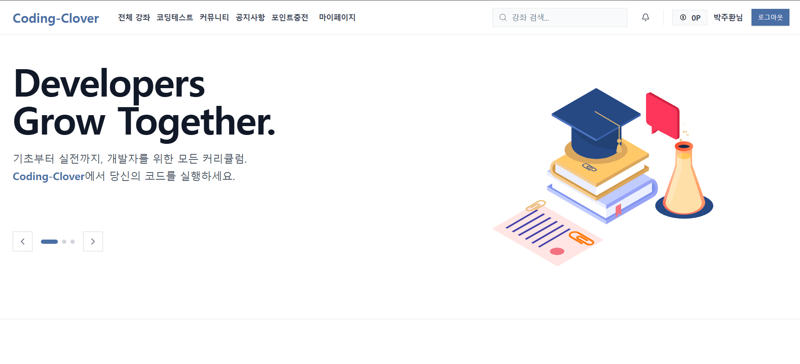 |
| **코딩테스트** | 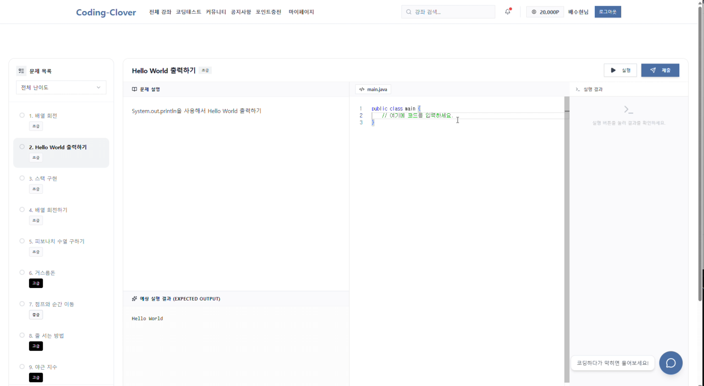 |
| **AI 챗봇** | 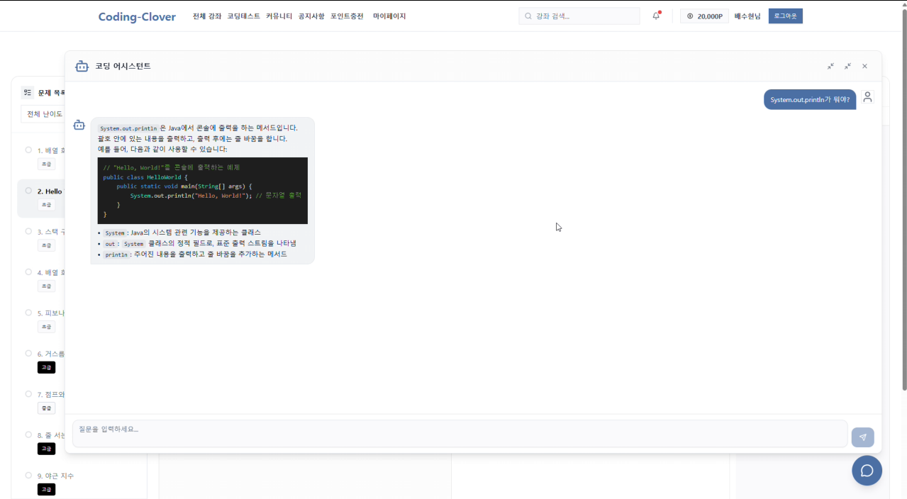 |
| **시험** | 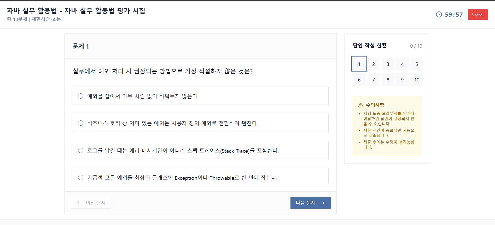 |
| **수강 강좌 목록** | 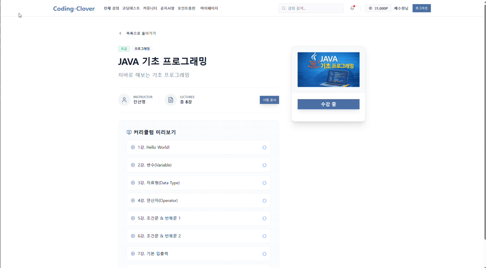 |
| **포인트 충전** | 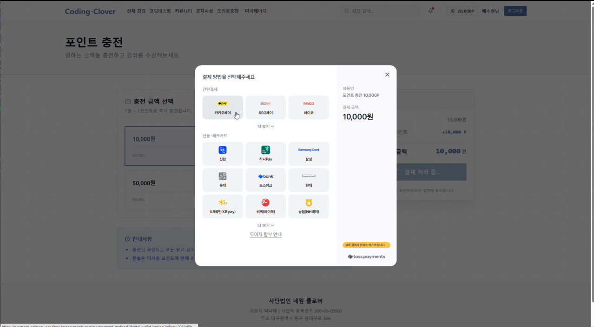 |

### 6-2. 강사 권한 (Instructor Interface)
| 주요 기능 | 화면 이미지 |
| :--- | :--- |
| **강사 대시보드** | 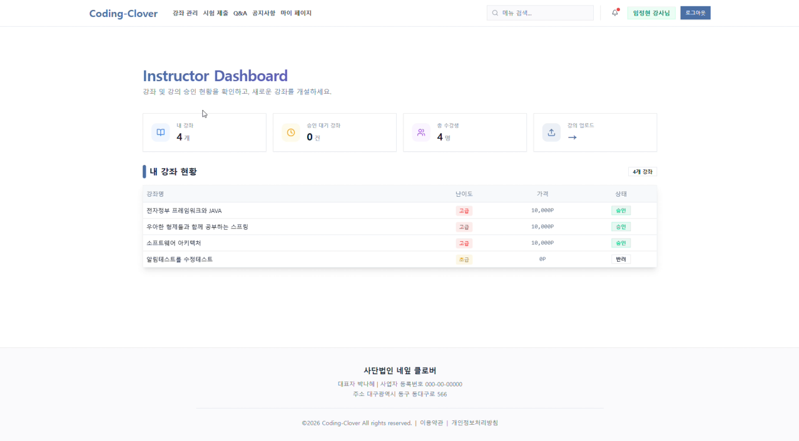 |
| **강좌 관리** | 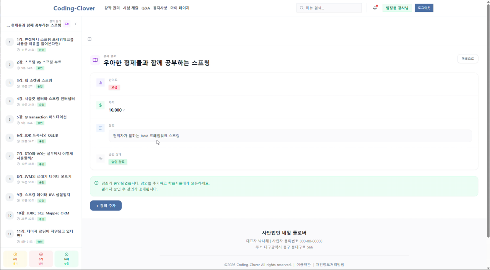 |
| **강의 관리** | 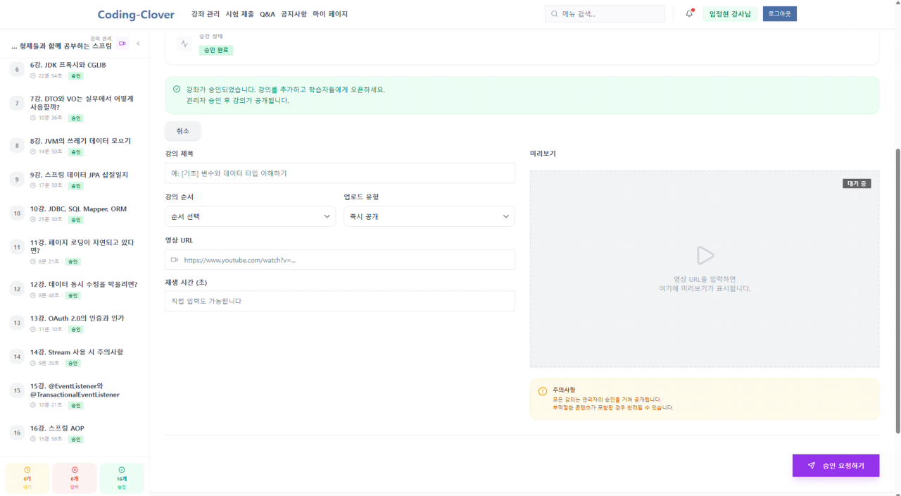 |
| **AI 시험 자동 생성** | 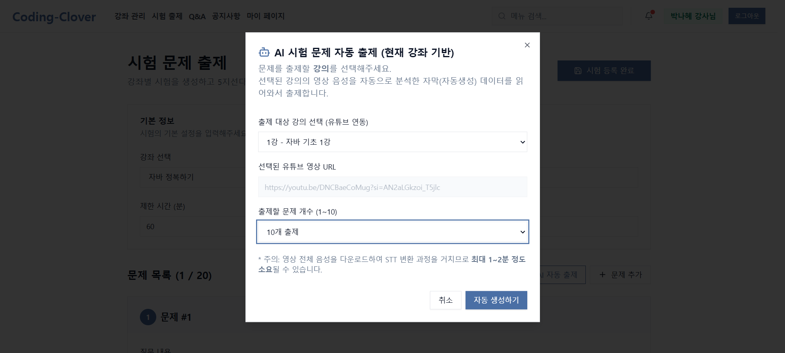 |
| **수강생 성적 통계** | 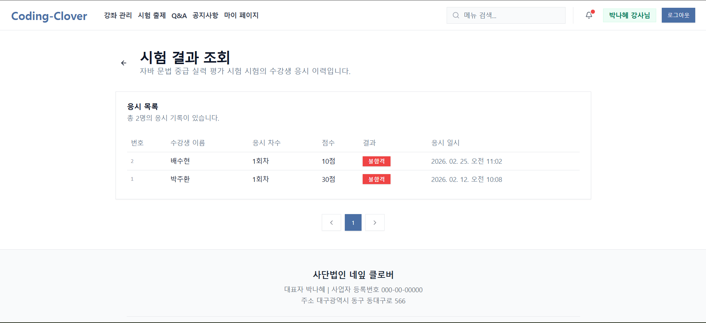 |

### 6-3. 관리자 권한 (Admin Interface)
| 주요 기능 | 화면 이미지 |
| :--- | :--- |
| **관리자 대시보드** | 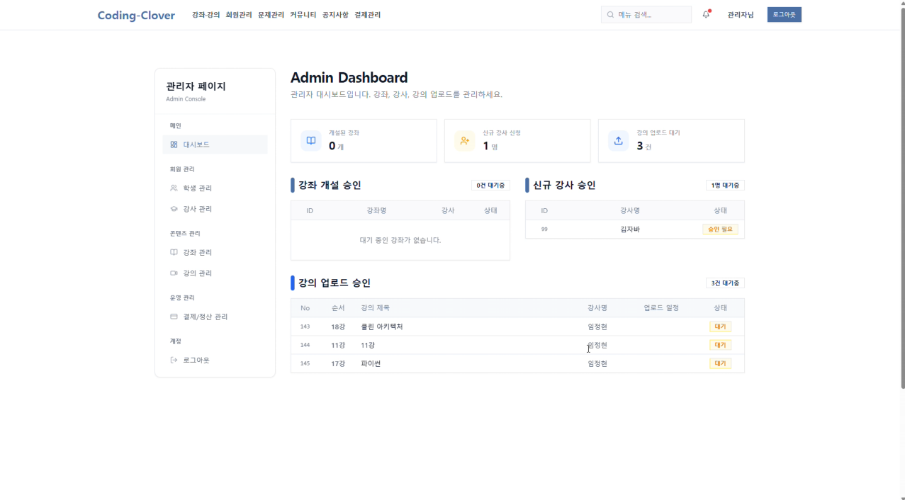 |
| **회원 및 권한 관리** | 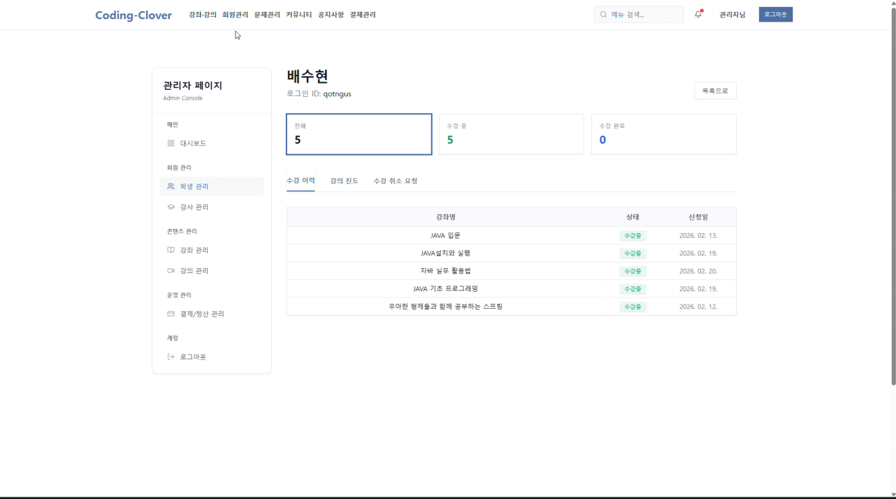 |
| **AI 코딩테스트 자동 생성** | 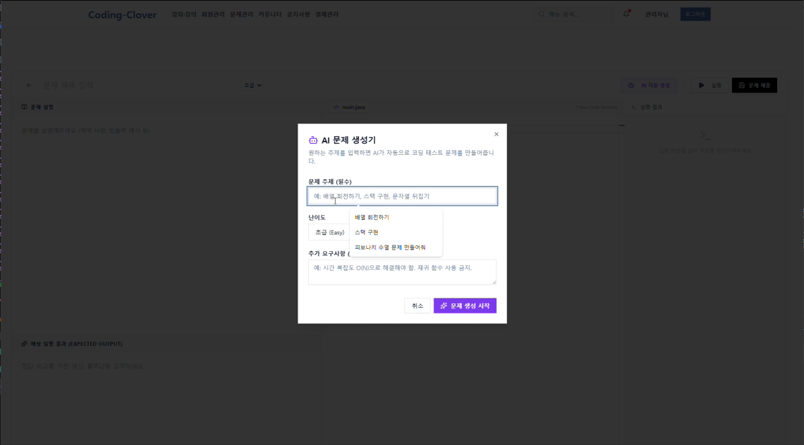 |
| **결제 및 매출 현황** | 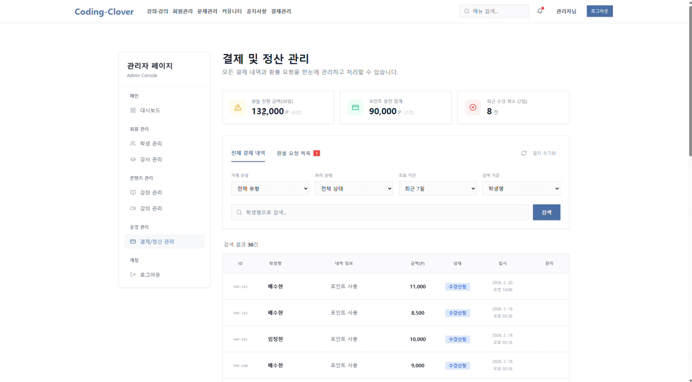 |

---

## 7) 프로젝트 구조 (Project Structure Summary)
*   **`src/main/java/.../AiQuiz/`**: AI 퀴즈 생성 핵심 로직 및 API 컨트롤러
*   **`src/main/java/.../Users/`**: 회원 관리 및 인증/보안 도메인
*   **`src/main/java/.../Course/`**: 교육 과정 및 강의 관리 엔진
*   **`codingclover/frontend/`**: React 기반 UI 및 AI 통신 연동부

---
