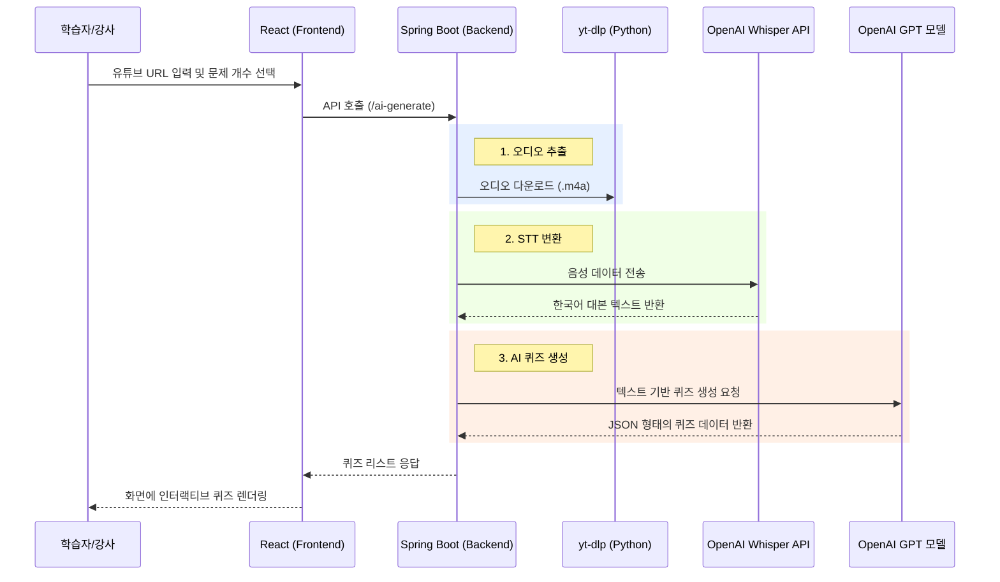

# 🍀 Coding Clover: AI 기반 유튜브 학습 전이 및 인텔리전트 LMS 솔루션

> **"유튜브의 방대한 지식을 당신만의 완벽한 학습 데이터셋으로 전환합니다."**  
> Coding Clover는 유튜브 영상에서 AI 기술을 투입해 음성을 추출(STT)하고, 이를 기반으로 객관식 퀴즈를 자동 생성하여 학습 효율을 극대화하는 혁신적인 AI-Integrated LMS(Learning Management System)입니다.

---

## 💡 프로젝트 동기: 학습과 AI 기술의 결합 (Learning & Intelligence)

본 프로젝트는 **방대한 영상 지식의 비효율적 습득 문제**를 해결하기 위해 기획되었습니다.  

*   **한계 돌파**: 사람이 직접 강의 자막을 보고 문제를 만드는 수동성을 탈피, AI 파이프라인으로 자동화하여 즉각적으로 학습 효율을 높입니다.
*   **통합적 가치**: 단순한 퀴즈 툴이 아닌, 강좌 관리, 학생 프로필, 결제 시스템, Q&A 커뮤니티가 결합된 완전한 학습 생태계를 지향합니다.
*   **안정적인 인프라**: 대규모 데이터 처리(STT)와 보안이 강조된 설계를 통해 실제 서비스 가능한 수준의 견고한 시스템을 구축했습니다.

---

## 1) 주요 기능 (Key Features)

1.  **AI 유튜브 퀴즈 엔진 (YouTube-to-Quiz AI)**
    *   **yt-dlp 통합**: 유튜브의 음성 데이터를 고속으로 추출하여 서버 내 임시 전처리 수행.
    *   **OpenAI Whisper STT**: 단순 자막 파싱이 아닌, 실제 음성 데이터를 딥러닝으로 분석해 완벽해진 한국어 스크립트(Transcript) 생성.
    *   **GPT-4o 기반 동적 출제**: 생성된 텍스트에서 핵심 키워드를 추출하여 5지선다 객관식 문제를 1~10개까지 실시간 자동 생성.

2.  **커스텀 LMS 워크플로우 (Comprehensive LMS)**
    *   **교육 과정 관리**: 강좌(Course) 및 강의(Lecture) 등록, 학생 수강 신청(Enrollment) 및 진행률 모니터링.
    *   **통합 Q&A 및 커뮤니티**: 마크다운 기반의 정밀한 질의응답 및 학습자 간 네트외킹 공간 제공.

3.  **지능형 회원 및 보안 시스템 (Security & Profile)**
    *   **역할 기반 접근 제어 (RBAC)**: 학생과 강사 프로필을 분리하여 각각 최적화된 대시보드 제공.
    *   **Spring Security & OAuth2**: 안전한 인증 로직과 멀티 로그인 환경 지원.

---

## 2) 시스템 아키텍처 (System Architecture)



---

## 3) 기술 스택 (Tech Stack)

| Category | Technology |
| :--- | :--- |
| **Backend** | Java 21, Spring Boot 3.4.13, Gradle, Spring AI (OpenAI) |
| **Frontend** | React, JavaScript, Vanilla CSS, Axios, Lottie-React |
| **Storage** | MySQL (RDS), Amazon S3, Hibernate/JPA |
| **Security** | Spring Security 6, OAuth2, JWT |
| **External** | OpenAI Whisper (STT), OpenAI GPT-4o, yt-dlp (Python) |

---

## 4) 실행 가이드 (Execution Guide)

### 4-1. 사전 요구사항
*   **Python**: `yt-dlp` 모듈 설치 필수 (`python -m pip install yt-dlp`)
*   **OpenAI API Key**: `.env` 파일에 `OPENAI_API_KEY` 설정 (Spring AI 연동)
*   **DB**: MySQL 호환 데이터베이스 구성 (`application.properties`의 RDS 정보 확인)

### 4-2. 실행 방법
1.  **Backend (Spring Boot)**: 
    ```powershell
    cd codingclover
    ./gradlew bootRun
    ```
    *   기본 포트: **3333** (`server.port=3333`)
2.  **Frontend (React/Vite)**: 
    ```powershell
    cd codingclover/frontend
    npm install
    npm run dev
    ```
    *   기본 포트: **5173** (백엔드 포트 3333으로 프록시 설정됨)

---

## 5) 서비스 실행 화면 (Service Screenshots)

### 5-1. 학생 권한 (Student Interface)
| 주요 기능 | 화면 이미지 |
| :--- | :--- |
| **학습 대시보드** |  |
| **코딩테스트** |  |
| **AI 챗봇** |  |
| **시험** |  |
| **수강 강좌 목록** |  |
| **포인트 충전** |  |

### 5-2. 강사 권한 (Instructor Interface)
| 주요 기능 | 화면 이미지 |
| :--- | :--- |
| **강사 대시보드** |  |
| **강좌 관리** |  |
| **강의 관리** |  |
| **AI 시험 자동 생성** |  |
| **수강생 성적 통계** |  |

### 5-3. 관리자 권한 (Admin Interface)
| 주요 기능 | 화면 이미지 |
| :--- | :--- |
| **관리자 대시보드** |  |
| **회원 및 권한 관리** |  |
| **AI 코딩테스트 자동 생성** |  |
| **결제 및 매출 현황** |  |

---

## 6) 프로젝트 구조 (Project Structure Summary)
*   **`src/main/java/.../AiQuiz/`**: AI 퀴즈 생성 핵심 로직 및 API 컨트롤러
*   **`src/main/java/.../Users/`**: 회원 관리 및 인증/보안 도메인
*   **`src/main/java/.../Course/`**: 교육 과정 및 강의 관리 엔진
*   **`codingclover/frontend/`**: React 기반 UI 및 AI 통신 연동부

---
